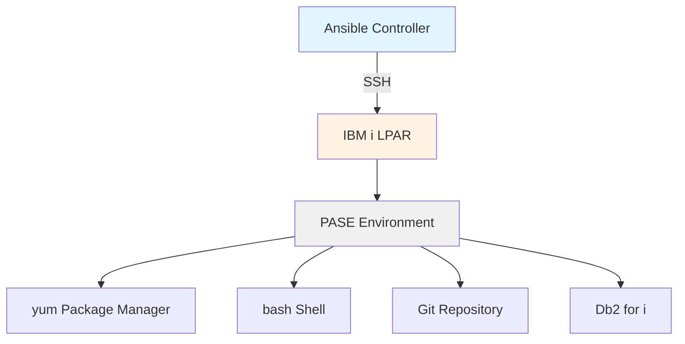
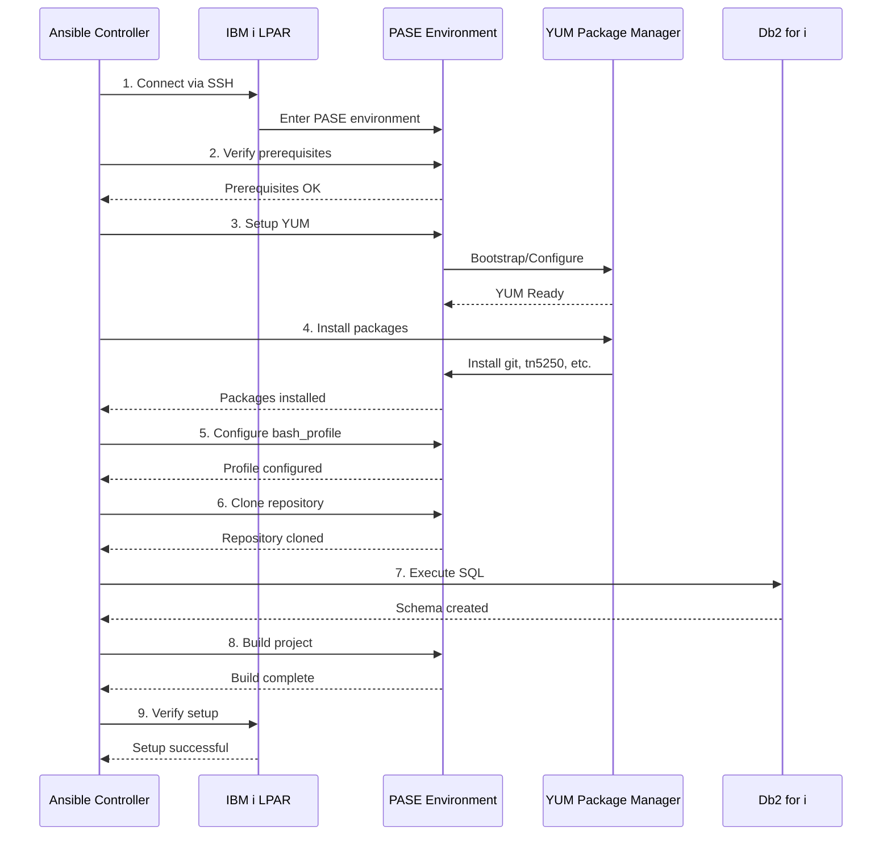

# Ansible Playbook Design for IBM i LPAR Setup

## Executive Summary

This document outlines the architectural design for an Ansible playbook that automates the preparation of an IBM i 7.5 LPAR for use with IBM Bob. The playbook will be executed from a separate controller machine (Linux/Windows) connecting to the IBM i system via SSH.

## Table of Contents

1. [Architecture Overview](#architecture-overview)
2. [Directory Structure](#directory-structure)
3. [IBM i-Specific Considerations](#ibm-i-specific-considerations)
4. [Inventory Design](#inventory-design)
5. [Role Specifications](#role-specifications)
6. [Variables and Configuration](#variables-and-configuration)
7. [Error Handling and Idempotency](#error-handling-and-idempotency)
8. [Execution Flow](#execution-flow)
9. [Prerequisites](#prerequisites)
10. [Testing Strategy](#testing-strategy)

---

## Architecture Overview

### Design Principles

1. **Modularity**: Each logical setup step is encapsulated in a dedicated role
2. **Idempotency**: All tasks can be safely re-run without side effects
3. **IBM i Native**: Leverage PASE (Portable Application Solutions Environment) for Unix-like operations
4. **Error Resilience**: Comprehensive error handling with meaningful failure messages
5. **Maintainability**: Clear separation of concerns with well-documented variables

### High-Level Architecture



### Technology Stack

- **Ansible Version**: 2.9+ (recommended 2.15+)
- **IBM i Version**: 7.5
- **Connection Method**: SSH to PASE environment
- **Shell**: bash (via /QOpenSys/pkgs/bin/bash)
- **Package Manager**: yum (via /QOpenSys/pkgs/bin/yum)
- **Python**: Python 3 in PASE environment

---

## Directory Structure

```
bob-for-ibmi/
├── ansible.cfg                 # Ansible configuration
├── site.yml                    # Main playbook entry point
├── inventory/
│   ├── production/
│   │   ├── hosts.yml          # Production inventory
│   │   └── group_vars/
│   │       └── ibmi.yml       # IBM i group variables
│   └── development/
│       ├── hosts.yml          # Development inventory
│       └── group_vars/
│           └── ibmi.yml       # IBM i group variables
├── roles/
│   ├── ibmi_prerequisites/    # Verify and setup prerequisites
│   │   ├── tasks/
│   │   │   └── main.yml
│   │   ├── defaults/
│   │   │   └── main.yml
│   │   └── README.md
│   ├── ibmi_yum_setup/        # Configure yum package manager
│   │   ├── tasks/
│   │   │   └── main.yml
│   │   ├── defaults/
│   │   │   └── main.yml
│   │   └── README.md
│   ├── ibmi_packages/         # Install required packages
│   │   ├── tasks/
│   │   │   └── main.yml
│   │   ├── defaults/
│   │   │   └── main.yml
│   │   └── README.md
│   ├── ibmi_bash_profile/     # Configure bash profile
│   │   ├── tasks/
│   │   │   └── main.yml
│   │   ├── templates/
│   │   │   └── bash_profile.j2
│   │   ├── defaults/
│   │   │   └── main.yml
│   │   └── README.md
│   ├── ibmi_repository/       # Clone and setup repository
│   │   ├── tasks/
│   │   │   └── main.yml
│   │   ├── defaults/
│   │   │   └── main.yml
│   │   └── README.md
│   ├── ibmi_database/         # Setup database samples
│   │   ├── tasks/
│   │   │   └── main.yml
│   │   ├── defaults/
│   │   │   └── main.yml
│   │   └── README.md
│   └── ibmi_project_build/    # Build the project
│       ├── tasks/
│       │   └── main.yml
│       ├── defaults/
│       │   └── main.yml
│       └── README.md
├── group_vars/
│   └── all.yml                # Global variables
├── host_vars/                 # Host-specific variables (optional)
├── files/                     # Static files
├── templates/                 # Jinja2 templates
├── docs/
│   ├── ansible-design.md      # This document
│   └── deployment-guide.md    # Deployment instructions
└── README.md                  # Project overview
```

### File Organization Rationale

- **`site.yml`**: Single entry point for the entire playbook
- **`inventory/`**: Separate production and development environments
- **`roles/`**: Each role handles one logical setup phase
- **`group_vars/`**: Shared variables across all hosts
- **`host_vars/`**: Host-specific overrides (if needed)

---

## IBM i-Specific Considerations

### PASE Environment

IBM i's PASE (Portable Application Solutions Environment) provides a Unix-like runtime environment. All operations will be executed within PASE.

**Key Characteristics:**
- Uses `/QOpenSys` as the root for open-source tools
- Package manager: `yum` (located at `/QOpenSys/pkgs/bin/yum`)
- Shell: `bash` (located at `/QOpenSys/pkgs/bin/bash`)
- Python: Available via yum packages

### Connection Configuration

**SSH Connection Requirements:**
- Connect to IBM i via SSH (default port 22)
- User must have authority to:
  - Access PASE environment
  - Install packages via yum
  - Execute SQL commands
  - Write to home directory
  - Execute shell commands

**Ansible Connection Plugin:**
- Use `ansible.builtin.ssh` connection plugin
- Set `ansible_shell_executable: /QOpenSys/pkgs/bin/bash`
- Set `ansible_python_interpreter: /QOpenSys/pkgs/bin/python3`

### IBM i Modules

**Standard Ansible Modules:**
Most standard Ansible modules work in PASE:
- `ansible.builtin.command`
- `ansible.builtin.shell`
- `ansible.builtin.copy`
- `ansible.builtin.template`
- `ansible.builtin.lineinfile`
- `ansible.builtin.git`
- `ansible.builtin.package` (with yum)

**IBM i-Specific Modules:**
Consider using IBM's `ibm.power_ibmi` collection for advanced operations:
- `ibm.power_ibmi.ibmi_sql_execute` - Execute SQL commands
- `ibm.power_ibmi.ibmi_cl_command` - Execute CL commands
- `ibm.power_ibmi.ibmi_object_authority` - Manage object authorities

**Installation:**
```bash
ansible-galaxy collection install ibm.power_ibmi
```

### Path Considerations

**Critical Paths:**
- Open-source binaries: `/QOpenSys/pkgs/bin/`
- User home directories: `/home/USERNAME/`
- IFS root: `/`
- Traditional IBM i libraries: `/QSYS.LIB/`

**PATH Environment:**
Must include `/QOpenSys/pkgs/bin` before system paths to prioritize open-source tools.

### Character Encoding

- Use UTF-8 encoding (`LANG=EN_US.UTF-8`)
- Required for many modern tools (git, tmux, etc.)

### User Profile Considerations

- IBM i user profiles may have different home directory structures
- Default shell may not be bash
- Profile must have appropriate authorities for package installation

---

## Inventory Design

### Inventory Structure

**File: `inventory/production/hosts.yml`**

```yaml
all:
  children:
    ibmi:
      hosts:
        ibmi-lpar-01:
          ansible_host: 192.168.1.100
          ansible_user: BOBUSER
          ansible_ssh_private_key_file: ~/.ssh/ibmi_rsa
      vars:
        ansible_connection: ssh
        ansible_shell_executable: /QOpenSys/pkgs/bin/bash
        ansible_python_interpreter: /QOpenSys/pkgs/bin/python3
        ansible_ssh_common_args: '-o StrictHostKeyChecking=no'
```

### Group Variables

**File: `inventory/production/group_vars/ibmi.yml`**

```yaml
---
# IBM i specific settings
ibmi_version: "7.5"
ibmi_pase_root: "/QOpenSys/pkgs"

# User configuration
target_user: "{{ ansible_user }}"
target_home: "/home/{{ target_user }}"

# Repository settings
repository_url: "https://github.com/IBM/ibmi-company_system"
repository_dest: "{{ target_home }}/ibmi-company_system"

# Database settings
sql_schema: "CMPSYS"
```

### Inventory Best Practices

1. **Separate Environments**: Maintain distinct inventory files for dev/test/prod
2. **SSH Key Authentication**: Use SSH keys instead of passwords
3. **Connection Pooling**: Enable ControlMaster for faster connections
4. **Timeout Settings**: Increase timeouts for slow IBM i operations

---

## Role Specifications

### Role 1: ibmi_prerequisites

**Purpose**: Verify system prerequisites and prepare the environment

**Tasks:**
1. Verify SSH connectivity
2. Check IBM i version (must be 7.5+)
3. Verify PASE environment is accessible
4. Check if bash shell exists
5. Verify user has necessary authorities
6. Create required directories

**Key Variables:**
- `required_ibmi_version: "7.5"`
- `required_directories: ["/home/{{ target_user }}"]`

**Idempotency Strategy:**
- Use `stat` module to check existence before creation
- Use `assert` module for version checks

**Error Handling:**
- Fail fast if prerequisites not met
- Provide clear error messages with remediation steps

---

### Role 2: ibmi_yum_setup

**Purpose**: Configure and verify yum package manager

**Tasks:**
1. Check if yum is installed
2. Install yum if not present (via bootstrap script)
3. Update yum repository metadata
4. Verify yum is functional
5. Configure yum repositories if needed

**Key Variables:**
- `yum_binary: "/QOpenSys/pkgs/bin/yum"`
- `bootstrap_url: "https://public.dhe.ibm.com/software/ibmi/products/pase/rpms/bootstrap.sh"`

**Idempotency Strategy:**
- Check yum existence before installation
- Use `yum list installed` to verify packages

**Error Handling:**
- Retry yum operations with exponential backoff
- Validate yum functionality after installation

**Special Considerations:**
- Bootstrap script requires internet connectivity
- May need to configure proxy settings
- First-time setup can take 10-15 minutes

---

### Role 3: ibmi_packages

**Purpose**: Install required open-source packages

**Tasks:**
1. Update package cache
2. Install packages in dependency order:
   - git (required for cloning)
   - tn5250 (terminal emulator)
   - service-commander (service management)
   - mapepire-server (database connectivity)
   - rsync (file synchronization)
   - ibmichroot (chroot environment)
   - nano (text editor)
   - tobi (IBM i tools)
3. Verify each package installation
4. Record installed package versions

**Key Variables:**
```yaml
required_packages:
  - git
  - tn5250
  - service-commander
  - mapepire-server
  - rsync
  - ibmichroot
  - nano
  - tobi
```

**Idempotency Strategy:**
- Use `yum list installed` to check before installation
- Use `state: present` in package module

**Error Handling:**
- Install packages individually to isolate failures
- Log package versions for troubleshooting
- Provide package-specific error messages

**Performance Optimization:**
- Consider installing packages in parallel (if dependencies allow)
- Cache package metadata

---

### Role 4: ibmi_bash_profile

**Purpose**: Configure user's bash profile with required environment variables

**Tasks:**
1. Backup existing `.bash_profile` if present
2. Create/update `.bash_profile` with:
   - Custom PS1 prompt
   - PATH with `/QOpenSys/pkgs/bin`
   - LANG=EN_US.UTF-8
3. Verify profile syntax
4. Source profile to validate

**Key Variables:**
```yaml
bash_profile_path: "{{ target_home }}/.bash_profile"
bash_ps1: '\e[1;34m[\u@\h \W]\$ \e[m'
bash_path: '/QOpenSys/pkgs/bin:$PATH'
bash_lang: 'EN_US.UTF-8'
backup_suffix: '.ansible-backup'
```

**Template: `templates/bash_profile.j2`**
```bash
# Managed by Ansible - DO NOT EDIT MANUALLY
# Last updated: {{ ansible_date_time.iso8601 }}

## PS1: Shell prompt format
PS1="{{ bash_ps1 }}"
export PS1

## PATH: All PASE binaries are in /QOpenSys/pkgs/bin
PATH={{ bash_path }}
export PATH

## LANG: some tools (for example: tmux) need UTF-8 charset
LANG={{ bash_lang }}
export LANG

# User customizations below this line

{{ bash_profile_custom_content }}

```

**Idempotency Strategy:**
- Use `template` module with `backup: yes`
- Check if content already matches before updating
- Use markers to preserve user customizations

**Error Handling:**
- Validate bash syntax before applying
- Keep backup of original file
- Test profile by sourcing it

---

### Role 5: ibmi_repository

**Purpose**: Clone the IBM i company system repository

**Tasks:**
1. Check if repository already exists
2. Clone repository if not present
3. Update repository if already cloned
4. Set correct ownership and permissions
5. Verify repository integrity

**Key Variables:**
```yaml
repository_url: "https://github.com/IBM/ibmi-company_system"
repository_dest: "{{ target_home }}/ibmi-company_system"
repository_version: "main"  # or specific tag/branch
repository_force: no  # whether to discard local changes
```

**Idempotency Strategy:**
- Use `git` module with `update: yes`
- Check repository status before operations
- Use `force: no` to preserve local changes

**Error Handling:**
- Verify git is installed before cloning
- Handle network connectivity issues
- Validate repository after clone

**Special Considerations:**
- May require SSH key for private repositories
- Consider using HTTPS with token for authentication
- Handle large repository sizes

---

### Role 6: ibmi_database

**Purpose**: Execute SQL commands to create database samples

**Tasks:**
1. Verify Db2 for i is accessible
2. Check if schema already exists
3. Execute SQL command: `CALL QSYS.CREATE_SQL_SAMPLE('CMPSYS')`
4. Verify schema creation
5. Grant necessary authorities

**Key Variables:**
```yaml
sql_schema: "CMPSYS"
sql_command: "CALL QSYS.CREATE_SQL_SAMPLE('{{ sql_schema }}')"
db_user: "{{ target_user }}"
```

**Implementation Options:**

**Option A: Using ibm.power_ibmi collection**
```yaml
- name: Create SQL sample schema
  ibm.power_ibmi.ibmi_sql_execute:
    sql: "{{ sql_command }}"
    become_user: "{{ db_user }}"
```

**Option B: Using shell command**
```yaml
- name: Create SQL sample schema
  ansible.builtin.shell: |
    /QOpenSys/pkgs/bin/db2 "{{ sql_command }}"
  args:
    executable: /QOpenSys/pkgs/bin/bash
```

**Idempotency Strategy:**
- Check if schema exists before creation
- Use SQL query to verify schema presence
- Skip creation if already exists

**Error Handling:**
- Verify database connectivity
- Check user authorities
- Provide detailed SQL error messages
- Rollback on failure (if possible)

**Special Considerations:**
- SQL operations may take time
- Requires appropriate database authorities
- May need to configure database connection parameters

---

### Role 7: ibmi_project_build

**Purpose**: Build the ibmi-company_system project

**Tasks:**
1. Verify makei is available
2. Navigate to project directory
3. Execute build command: `/QOpenSys/pkgs/bin/makei build`
4. Capture build output
5. Verify build success
6. Record build artifacts

**Key Variables:**
```yaml
project_dir: "{{ repository_dest }}"
build_command: "/QOpenSys/pkgs/bin/makei build"
build_log: "{{ project_dir }}/build.log"
build_timeout: 600  # 10 minutes
```

**Idempotency Strategy:**
- Check if build artifacts already exist
- Use timestamps to determine if rebuild needed
- Support `force_rebuild` flag

**Error Handling:**
- Capture and log build output
- Parse build errors for common issues
- Provide troubleshooting guidance
- Support retry with clean build

**Special Considerations:**
- Build may take significant time
- May require additional dependencies
- Build artifacts location may vary
- Consider parallel build options

---

## Variables and Configuration

### Variable Hierarchy

Ansible variable precedence (highest to lowest):
1. Extra vars (`-e` on command line)
2. Task vars
3. Block vars
4. Role vars
5. Play vars
6. Host vars
7. Group vars
8. Role defaults

### Global Variables

**File: `group_vars/all.yml`**

```yaml
---
# Global settings for all hosts
ansible_connection: ssh
ansible_ssh_common_args: '-o StrictHostKeyChecking=no -o UserKnownHostsFile=/dev/null'

# Timeout settings
ansible_command_timeout: 300
ansible_ssh_timeout: 30

# Retry settings
retry_count: 3
retry_delay: 5

# Logging
log_level: info
log_path: "/tmp/ansible-ibmi-setup.log"
```

### Role Default Variables

Each role should define sensible defaults in `defaults/main.yml`:

```yaml
---
# Example: roles/ibmi_packages/defaults/main.yml
package_state: present
package_update_cache: yes
package_cache_valid_time: 3600
package_install_timeout: 600
```

### Variable Naming Conventions

1. **Prefix with role name**: `ibmi_packages_list`, `ibmi_yum_binary`
2. **Use snake_case**: `repository_dest`, not `repositoryDest`
3. **Boolean values**: Use `yes`/`no` or `true`/`false` consistently
4. **Paths**: Always use absolute paths
5. **Sensitive data**: Use Ansible Vault for passwords/keys

### Sensitive Data Management

**Using Ansible Vault:**

```bash
# Create encrypted variables file
ansible-vault create inventory/production/group_vars/vault.yml

# Edit encrypted file
ansible-vault edit inventory/production/group_vars/vault.yml

# Run playbook with vault
ansible-playbook site.yml --ask-vault-pass
```

**Vault Variables:**
```yaml
---
vault_ssh_password: "secret_password"
vault_db_password: "db_secret"
vault_api_token: "github_token"
```

---

## Error Handling and Idempotency

### Error Handling Strategy

#### 1. Fail Fast Approach

For critical prerequisites:
```yaml
- name: Verify IBM i version
  ansible.builtin.assert:
    that:
      - ibmi_version is version('7.5', '>=')
    fail_msg: "IBM i version {{ ibmi_version }} is not supported. Minimum version is 7.5"
    success_msg: "IBM i version {{ ibmi_version }} is supported"
```

#### 2. Retry with Backoff

For network operations:
```yaml
- name: Install package
  ansible.builtin.package:
    name: "{{ item }}"
    state: present
  register: package_result
  retries: 3
  delay: 10
  until: package_result is succeeded
  loop: "{{ required_packages }}"
```

#### 3. Graceful Degradation

For optional features:
```yaml
- name: Install optional package
  ansible.builtin.package:
    name: optional-tool
    state: present
  ignore_errors: yes
  register: optional_install

- name: Warn about optional package
  ansible.builtin.debug:
    msg: "Warning: Optional package 'optional-tool' could not be installed"
  when: optional_install is failed
```

#### 4. Validation Checks

After critical operations:
```yaml
- name: Verify package installation
  ansible.builtin.command: "{{ yum_binary }} list installed {{ item }}"
  register: verify_result
  failed_when: verify_result.rc != 0
  changed_when: false
  loop: "{{ required_packages }}"
```

### Idempotency Patterns

#### 1. Check Before Action

```yaml
- name: Check if repository exists
  ansible.builtin.stat:
    path: "{{ repository_dest }}/.git"
  register: repo_stat

- name: Clone repository
  ansible.builtin.git:
    repo: "{{ repository_url }}"
    dest: "{{ repository_dest }}"
  when: not repo_stat.stat.exists
```

#### 2. Use Module State Parameters

```yaml
- name: Ensure package is present
  ansible.builtin.package:
    name: git
    state: present  # idempotent: installs only if not present
```

#### 3. Template with Validation

```yaml
- name: Deploy bash profile
  ansible.builtin.template:
    src: bash_profile.j2
    dest: "{{ bash_profile_path }}"
    backup: yes
    validate: '/QOpenSys/pkgs/bin/bash -n %s'
```

#### 4. Conditional Execution

```yaml
- name: Build project
  ansible.builtin.command:
    cmd: "{{ build_command }}"
    chdir: "{{ project_dir }}"
  args:
    creates: "{{ project_dir }}/build/output"  # skip if exists
```

### Error Recovery

#### Rollback Strategy

```yaml
- name: Setup block with rollback
  block:
    - name: Backup configuration
      ansible.builtin.copy:
        src: "{{ config_file }}"
        dest: "{{ config_file }}.backup"
        remote_src: yes

    - name: Update configuration
      ansible.builtin.template:
        src: config.j2
        dest: "{{ config_file }}"

  rescue:
    - name: Restore backup on failure
      ansible.builtin.copy:
        src: "{{ config_file }}.backup"
        dest: "{{ config_file }}"
        remote_src: yes

  always:
    - name: Clean up backup
      ansible.builtin.file:
        path: "{{ config_file }}.backup"
        state: absent
```

### Logging and Debugging

```yaml
- name: Enable detailed logging
  ansible.builtin.debug:
    msg: "Installing package {{ item }}"
    verbosity: 1
  loop: "{{ required_packages }}"

- name: Log operation result
  ansible.builtin.copy:
    content: |
      Operation: Package Installation
      Timestamp: {{ ansible_date_time.iso8601 }}
      Status: {{ package_result.rc }}
      Output: {{ package_result.stdout }}
    dest: "{{ log_path }}"
    mode: '0644'
  when: log_level == 'debug'
```

---

## Execution Flow

### Main Playbook Structure

**File: `site.yml`**

```yaml
---
- name: Prepare IBM i LPAR for IBM Bob
  hosts: ibmi
  gather_facts: yes
  become: no  # Use target user's profile
  
  pre_tasks:
    - name: Display execution information
      ansible.builtin.debug:
        msg:
          - "Target Host: {{ inventory_hostname }}"
          - "IBM i Version: {{ ibmi_version }}"
          - "User: {{ target_user }}"
          - "Timestamp: {{ ansible_date_time.iso8601 }}"
      tags: always

    - name: Verify connectivity
      ansible.builtin.ping:
      tags: always

  roles:
    - role: ibmi_prerequisites
      tags: [prerequisites, setup]
      
    - role: ibmi_yum_setup
      tags: [yum, packages, setup]
      
    - role: ibmi_packages
      tags: [packages, setup]
      
    - role: ibmi_bash_profile
      tags: [profile, config]
      
    - role: ibmi_repository
      tags: [repository, git]
      
    - role: ibmi_database
      tags: [database, sql]
      
    - role: ibmi_project_build
      tags: [build, compile]

  post_tasks:
    - name: Display completion summary
      ansible.builtin.debug:
        msg:
          - "Setup completed successfully!"
          - "Repository location: {{ repository_dest }}"
          - "Database schema: {{ sql_schema }}"
          - "Build status: Complete"
      tags: always

    - name: Create completion marker
      ansible.builtin.file:
        path: "{{ target_home }}/.ibmi-bob-setup-complete"
        state: touch
        mode: '0644'
      tags: always
```

### Execution Sequence Diagram



### Execution Commands

#### Full Setup

```bash
# Run complete setup
ansible-playbook -i inventory/production/hosts.yml site.yml

# Run with vault password
ansible-playbook -i inventory/production/hosts.yml site.yml --ask-vault-pass

# Run with extra variables
ansible-playbook -i inventory/production/hosts.yml site.yml \
  -e "repository_version=v1.2.3" \
  -e "force_rebuild=yes"
```

#### Partial Execution with Tags

```bash
# Only setup packages
ansible-playbook -i inventory/production/hosts.yml site.yml --tags packages

# Skip database setup
ansible-playbook -i inventory/production/hosts.yml site.yml --skip-tags database

# Run multiple specific roles
ansible-playbook -i inventory/production/hosts.yml site.yml --tags "yum,packages,profile"
```

#### Dry Run (Check Mode)

```bash
# Test without making changes
ansible-playbook -i inventory/production/hosts.yml site.yml --check

# Show differences that would be made
ansible-playbook -i inventory/production/hosts.yml site.yml --check --diff
```

#### Verbose Execution

```bash
# Verbose output
ansible-playbook -i inventory/production/hosts.yml site.yml -v

# Very verbose (connection debugging)
ansible-playbook -i inventory/production/hosts.yml site.yml -vvv

# Extremely verbose (includes module arguments)
ansible-playbook -i inventory/production/hosts.yml site.yml -vvvv
```

### Execution Time Estimates

| Phase | Estimated Time | Notes |
|-------|---------------|-------|
| Prerequisites | 1-2 minutes | Quick checks |
| YUM Setup | 10-15 minutes | First-time bootstrap |
| Package Installation | 5-10 minutes | Depends on package count |
| Bash Profile | < 1 minute | Quick file operation |
| Repository Clone | 2-5 minutes | Depends on repo size |
| Database Setup | 2-3 minutes | SQL execution |
| Project Build | 5-10 minutes | Depends on project size |
| **Total** | **25-45 minutes** | First-time setup |

**Subsequent runs** (with packages cached): 5-10 minutes

---

## Prerequisites

### Controller Machine Requirements

1. **Ansible Installation**
   ```bash
   # Install Ansible (Linux)
   pip install ansible>=2.15
   
   # Install IBM i collection
   ansible-galaxy collection install ibm.power_ibmi
   ```

2. **SSH Client**
   - OpenSSH client installed
   - SSH key pair generated

3. **Network Connectivity**
   - Access to IBM i LPAR on port 22
   - Internet access for package downloads

### IBM i LPAR Requirements

1. **System Requirements**
   - IBM i version 7.5 or higher
   - Sufficient disk space (minimum 5GB free in `/QOpenSys`)
   - PASE environment enabled

2. **User Profile Requirements**
   - User profile with *ALLOBJ authority (or specific authorities)
   - SSH access enabled
   - Home directory created (`/home/USERNAME`)

3. **Network Requirements**
   - SSH daemon running
   - Internet connectivity for package downloads
   - DNS resolution working

4. **Optional: Pre-installed Components**
   - Python 3 in PASE (will be installed if missing)
   - bash shell (will be installed if missing)

### Pre-Setup Checklist

- [ ] IBM i LPAR is accessible via SSH
- [ ] User profile has necessary authorities
- [ ] Network connectivity to internet is available
- [ ] Sufficient disk space in `/QOpenSys`
- [ ] SSH key authentication is configured
- [ ] Ansible controller can reach IBM i LPAR
- [ ] IBM i version is 7.5 or higher
- [ ] PASE environment is accessible

---

## Testing Strategy

### Unit Testing (Role-Level)

Each role should be testable independently:

```yaml
# tests/test_ibmi_packages.yml
---
- name: Test package installation role
  hosts: ibmi
  roles:
    - ibmi_packages
  
  post_tasks:
    - name: Verify git is installed
      ansible.builtin.command: /QOpenSys/pkgs/bin/git --version
      register: git_version
      failed_when: git_version.rc != 0
      changed_when: false
```

### Integration Testing

Test complete workflow:

```yaml
# tests/test_integration.yml
---
- name: Integration test - Full setup
  hosts: ibmi
  roles:
    - ibmi_prerequisites
    - ibmi_yum_setup
    - ibmi_packages
    - ibmi_bash_profile
    - ibmi_repository
    - ibmi_database
    - ibmi_project_build
  
  post_tasks:
    - name: Verify complete setup
      ansible.builtin.include_tasks: verify_setup.yml
```

### Validation Tasks

**File: `tests/verify_setup.yml`**

```yaml
---
- name: Verify packages are installed
  ansible.builtin.command: "yum list installed {{ item }}"
  loop: "{{ required_packages }}"
  changed_when: false

- name: Verify bash profile exists
  ansible.builtin.stat:
    path: "{{ bash_profile_path }}"
  register: profile_stat
  failed_when: not profile_stat.stat.exists

- name: Verify repository is cloned
  ansible.builtin.stat:
    path: "{{ repository_dest }}/.git"
  register: repo_stat
  failed_when: not repo_stat.stat.exists

- name: Verify database schema exists
  ansible.builtin.shell: |
    /QOpenSys/pkgs/bin/db2 "SELECT COUNT(*) FROM QSYS2.SYSTABLES WHERE TABLE_SCHEMA = '{{ sql_schema }}'"
  register: schema_check
  failed_when: "'0' in schema_check.stdout"
  changed_when: false

- name: Verify build artifacts exist
  ansible.builtin.stat:
    path: "{{ project_dir }}/build"
  register: build_stat
  failed_when: not build_stat.stat.exists
```

### Test Execution

```bash
# Run unit tests
ansible-playbook -i inventory/development/hosts.yml tests/test_ibmi_packages.yml

# Run integration tests
ansible-playbook -i inventory/development/hosts.yml tests/test_integration.yml

# Run validation only
ansible-playbook -i inventory/production/hosts.yml tests/verify_setup.yml
```

### Continuous Testing

Consider using Molecule for automated testing:

```yaml
# molecule/default/molecule.yml
---
dependency:
  name: galaxy
driver:
  name: delegated
platforms:
  - name: ibmi-test
    groups:
      - ibmi
provisioner:
  name: ansible
  inventory:
    group_vars:
      ibmi:
        ansible_connection: ssh
verifier:
  name: ansible
```

---

## Appendices

### Appendix A: Ansible Configuration

**File: `ansible.cfg`**

```ini
[defaults]
# Inventory
inventory = inventory/production/hosts.yml
host_key_checking = False

# Output
stdout_callback = yaml
bin_ansible_callbacks = True

# Performance
forks = 5
gathering = smart
fact_caching = jsonfile
fact_caching_connection = /tmp/ansible_facts
fact_caching_timeout = 3600

# SSH
timeout = 30
ssh_args = -o ControlMaster=auto -o ControlPersist=60s

# Logging
log_path = /tmp/ansible-ibmi.log

# Roles
roles_path = roles

[privilege_escalation]
become = False

[ssh_connection]
pipelining = True
control_path = /tmp/ansible-ssh-%%h-%%p-%%r
```

### Appendix B: Common Issues and Solutions

| Issue | Cause | Solution |
|-------|-------|----------|
| SSH connection timeout | Firewall or network issue | Verify port 22 is open, check network connectivity |
| YUM bootstrap fails | No internet access | Configure proxy settings, verify DNS |
| Package installation fails | Insufficient disk space | Free up space in `/QOpenSys` |
| SQL command fails | Insufficient authorities | Grant *ALLOBJ or specific DB authorities |
| Build fails | Missing dependencies | Check build logs, install missing packages |
| Bash profile not applied | Shell not changed | Verify shell is set to bash in user profile |

### Appendix C: IBM i Authority Requirements

**Minimum Required Authorities:**

1. **Object Authorities:**
   - `*USE` to `/QOpenSys/pkgs/bin/*`
   - `*CHANGE` to user's home directory
   - `*EXECUTE` to PASE environment

2. **Special Authorities:**
   - `*ALLOBJ` (recommended) OR
   - `*IOSYSCFG` (for system configuration)
   - `*SECADM` (for security administration)

3. **Database Authorities:**
   - `*EXECUTE` on `QSYS.CREATE_SQL_SAMPLE`
   - `*CHANGE` on target schema

### Appendix D: Performance Tuning

**Optimization Strategies:**

1. **Enable SSH Connection Multiplexing:**
   ```ini
   [ssh_connection]
   ssh_args = -o ControlMaster=auto -o ControlPersist=3600s
   pipelining = True
   ```

2. **Increase Parallel Execution:**
   ```ini
   [defaults]
   forks = 10
   ```

3. **Cache Facts:**
   ```ini
   [defaults]
   gathering = smart
   fact_caching = jsonfile
   fact_caching_timeout = 86400
   ```

4. **Use Package Cache:**
   ```yaml
   - name: Install packages with cache
     ansible.builtin.package:
       name: "{{ item }}"
       state: present
       update_cache: yes
       cache_valid_time: 3600
   ```

### Appendix E: Security Considerations

1. **SSH Key Management:**
   - Use strong SSH keys (RSA 4096 or Ed25519)
   - Protect private keys with passphrases
   - Rotate keys regularly

2. **Ansible Vault:**
   - Encrypt all sensitive variables
   - Use separate vault files per environment
   - Never commit unencrypted secrets

3. **User Authorities:**
   - Follow principle of least privilege
   - Use dedicated service account
   - Audit authority usage

4. **Network Security:**
   - Use VPN for remote access
   - Restrict SSH access by IP
   - Enable SSH key-only authentication

### Appendix F: Maintenance and Updates

**Regular Maintenance Tasks:**

1. **Update Packages:**
   ```bash
   ansible-playbook -i inventory/production/hosts.yml site.yml --tags packages -e "package_state=latest"
   ```

2. **Update Repository:**
   ```bash
   ansible-playbook -i inventory/production/hosts.yml site.yml --tags repository -e "repository_force=yes"
   ```

3. **Rebuild Project:**
   ```bash
   ansible-playbook -i inventory/production/hosts.yml site.yml --tags build -e "force_rebuild=yes"
   ```

4. **Verify Setup:**
   ```bash
   ansible-playbook -i inventory/production/hosts.yml tests/verify_setup.yml
   ```

---

## Conclusion

This design document provides a comprehensive blueprint for automating IBM i LPAR setup for IBM Bob. The modular role-based architecture ensures maintainability, while the idempotent design allows safe re-execution.

### Key Design Decisions

1. **Modular Roles**: Each setup phase is isolated in a dedicated role
2. **IBM i Native**: Leverages PASE environment and native tools
3. **Idempotent**: All operations can be safely re-run
4. **Error Resilient**: Comprehensive error handling and validation
5. **Flexible**: Tag-based execution for partial runs
6. **Documented**: Extensive inline documentation and examples

### Next Steps

1. Review and approve this design document
2. Create the directory structure
3. Implement each role sequentially
4. Test each role independently
5. Perform integration testing
6. Document deployment procedures
7. Create runbooks for common operations

### Success Criteria

- [ ] All packages installed successfully
- [ ] Bash profile configured correctly
- [ ] Repository cloned and accessible
- [ ] Database schema created
- [ ] Project builds without errors
- [ ] Setup is idempotent (can be re-run safely)
- [ ] All validation tests pass
- [ ] Documentation is complete

---

**Document Version**: 1.0  
**Last Updated**: 2026-03-03  
**Author**: Bob (Plan Mode)  
**Status**: Ready for Review